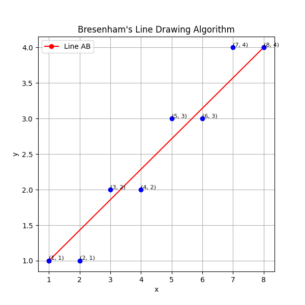
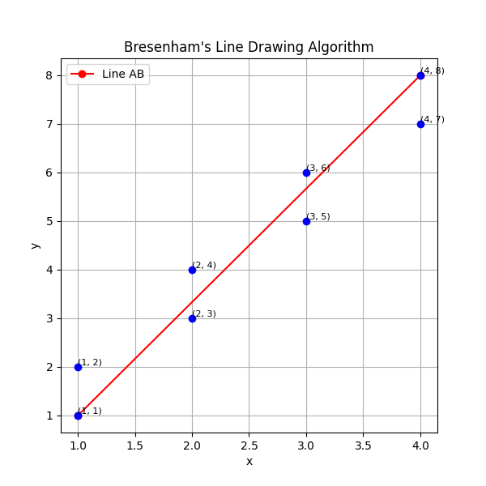

# CGI_Assignment

### Ouptut for case 1: 

**[(1, 1), (2, 1), (3, 2), (4, 2), (5, 3), (6, 3), (7, 4), (8, 4)]**   

 

### Output for case 2: 

**[(1, 1), (1, 2), (2, 3), (2, 4), (3, 5), (3, 6), (4, 7), (4, 8)]**   

 

## Explain what adjustments to the algorithm you have made for the slope of m>1 and why?

The main adjustment made to the algorithm for the slope (m) greater than 1 is in the decision-making process for plotting the next pixel along the line. In the original Bresenham's algorithm, the decision is based on the sign of a decision parameter, which is calculated differently depending on whether the slope is greater than 1 or not. When the slope is greater than 1, we can use Bresenham’s algorithm by exchanging the x and y values. after the calculations, exchange the x and y values back to get the pixels to display on the line.
